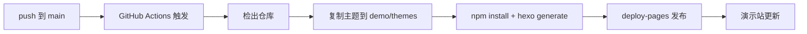

本演示站本身就是主题的一个「活」的用例：每次向 `main` 分支提交代码，GitHub Actions 都会自动重新构建并发布演示站，主题的最新改动即时可见。

## 工作原理



1. 仓库内 `demo/` 目录是完整的 Hexo 站点源文件（配置 + 文章）
2. workflow 把当前检出的主题代码复制进 `demo/themes/tranquility`，因此演示的永远是**本次提交**的主题版本
3. `hexo generate` 构建后经 `actions/deploy-pages` 发布到 GitHub Pages

## 关键配置片段

演示站启用了子路径部署（项目页），`_config.yml` 中：

```yaml
url: https://zycwer.github.io/hexo-theme-tranquility
root: /hexo-theme-tranquility/
```

主题会基于 `root` 正确处理全部资源路径、`manifest.json` 与 Service Worker 作用域。

## 本地复现

```bash
cd demo
npm install
cp -r ../ demo/themes/tranquility   # 以本地主题构建
npx hexo server                     # http://localhost:4000 预览
```

完整的构建流水线见仓库 [.github/workflows/deploy-demo.yml](https://github.com/zycwer/hexo-theme-tranquility/blob/main/.github/workflows/deploy-demo.yml)。
