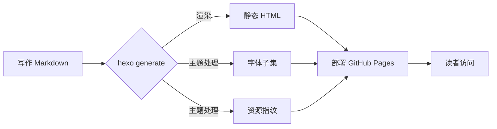
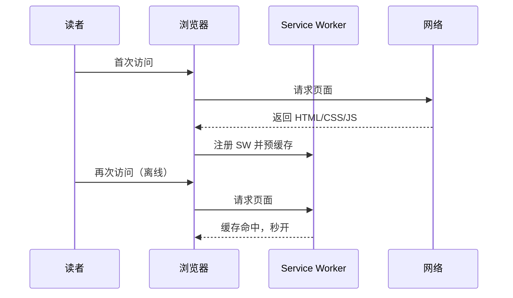
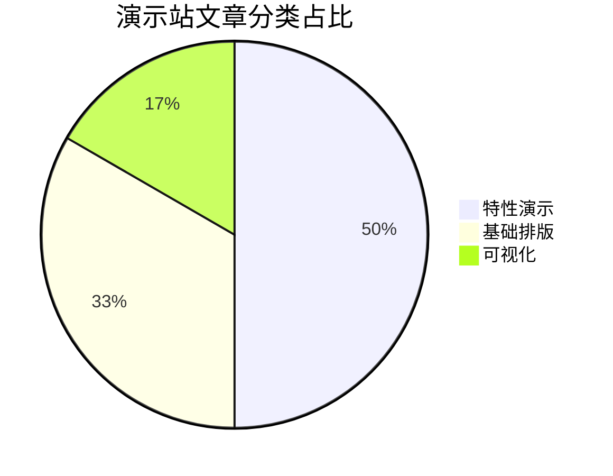
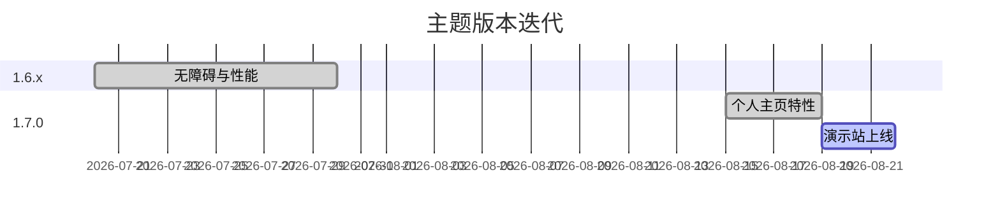

主题内置 Mermaid 支持，在代码块标记 `mermaid` 即可渲染图表。

## 流程图

```mermaid
graph LR
  A[写作 Markdown] --> B{hexo generate}
  B -->|渲染| C[静态 HTML]
  B -->|主题处理| D[字体子集]
  B -->|主题处理| E[资源指纹]
  C --> F[部署 GitHub Pages]
  D --> F
  E --> F
  F --> G[读者访问]
```

## 时序图

```mermaid
sequenceDiagram
  participant U as 读者
  participant B as 浏览器
  participant S as Service Worker
  participant N as 网络
  U->>B: 首次访问
  B->>N: 请求页面
  N-->>B: 返回 HTML/CSS/JS
  B->>S: 注册 SW 并预缓存
  U->>B: 再次访问（离线）
  B->>S: 请求页面
  S-->>B: 缓存命中，秒开
```

## 饼图

```mermaid
pie title 演示站文章分类占比
  "特性演示" : 3
  "基础排版" : 2
  "可视化" : 1
```

## 甘特图

```mermaid
gantt
  title 主题版本迭代
  dateFormat YYYY-MM-DD
  section 1.6.x
  无障碍与性能 :done, t1, 2026-07-20, 10d
  section 1.7.0
  个人主页特性 :done, t2, 2026-08-15, 4d
  演示站上线 :active, t3, 2026-08-19, 3d
```

> Mermaid 版本在主题配置中固定（默认 10.9.3），避免上游 breaking change 导致图表失效。
